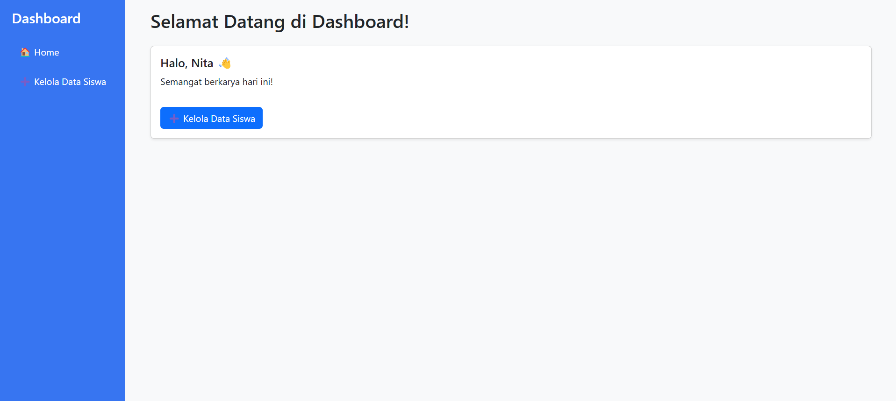
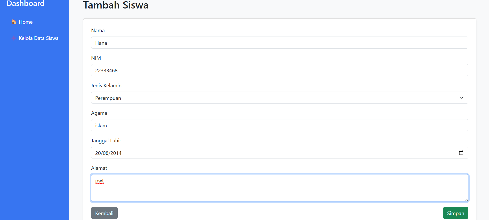

# 🎓 Laravel SI-PAW Dashboard & CRUD Siswa

Selamat datang di repositori **Laravel_Praktikum_SI_PAW** 👋  
Proyek ini dibuat sebagai latihan dasar Laravel untuk membangun sistem autentikasi (Login), Dashboard, dan fitur CRUD (Create, Read, Update, Delete) untuk data siswa.

## 🚀 Fitur Utama

-   🔐 Login & Logout
-   🧭 Akses halaman Dashboard hanya untuk user yang login
-   📚 Manajemen data siswa (CRUD)
-   🎨 Styling menggunakan Bootstrap 5
-   ✅ Validasi form dan notifikasi flash

---

## 🛠️ Cara Install & Setup

### 1. Clone Repository

```bash
git clone https://github.com/Nitaa1904/Laravel_Praktikum_SI_PAW.git
cd Laravel_Praktikum_SI_PAW
```

### 2. Install Dependency Laravel

```bash
composer install
```

### 3. Setup File `.env`

Duplikat file `.env.example` menjadi `.env`, lalu edit konfigurasi database:

```
DB_DATABASE=laravel_dashboard
DB_USERNAME=root
DB_PASSWORD=
```

### 4. Generate APP Key

```bash
php artisan key:generate
```

### 5. Buat Database

Buat database dengan nama `laravel_dashboard` melalui phpMyAdmin atau terminal:

```sql
CREATE DATABASE laravel_dashboard;
```

### 6. Migrasi Database

```bash
php artisan migrate
```

### 7. Buat User Manual via Tinker

```bash
php artisan tinker
```

```php
use App\Models\User;
use Illuminate\Support\Facades\Hash;

User::create([
    'name' => 'Nita',
    'email' => 'nita@gmail.com',
    'password' => Hash::make('password123')
]);
```

### 8. Jalankan Server Laravel

```bash
php artisan serve
```

Akses aplikasi di: [http://127.0.0.1:8000](http://127.0.0.1:8000)

---

## 🧑‍💻 Alur Penggunaan

1. **Akses Dashboard**
   ➤ Jika belum login, akan diarahkan ke halaman login.

2. **Login**

    - Email: `nita@gmail.com`
    - Password: `password123`

3. **Dashboard**

    - Terdapat tombol untuk mengelola data siswa.

4. **CRUD Siswa**

    - ➕ Tambah Data
    - 📋 Lihat Detail
    - ✏️ Edit
    - ❌ Hapus

---

## 📁 Struktur Folder Penting

```bash
├── app/
│   ├── Http/
│   │   └── Controllers/
│   │       ├── AuthController.php
│   │       └── SiswaController.php
├── resources/
│   └── views/
│       ├── auth/
│       │   └── login.blade.php
│       ├── siswa/
│       │   ├── index.blade.php
│       │   ├── create.blade.php
│       │   ├── edit.blade.php
│       │   └── show.blade.php
│       ├── dashboard.blade.php
│       └── layouts/
│           └── app.blade.php
├── routes/
│   └── web.php
```

---

## 🎨 Styling dengan Bootstrap 5

-   Navbar + Sidebar menggunakan Bootstrap grid
-   Tabel siswa: `table-striped`, `table-bordered`
-   Form: `form-group`, `form-control`
-   Tombol aksi: `btn btn-success`, `btn btn-warning`, `btn btn-danger`
-   Tampilan dashboard lebih clean dan modern

---

## 📸 Preview Antarmuka

### 📊 Dashboard Page



### 📋 Data Siswa (Index)


### ➕ Tambah/Edit Siswa



## 🤝 Kontribusi

Pull request sangat terbuka! Untuk perubahan besar, silakan buka issue terlebih dahulu.

---

## 👩‍💻 Dibuat Oleh

-   **Nita Fitrotul Mar'ah**
    Mahasiswa Sistem Informasi | Telkom University

---

## 📄 Lisensi

Proyek ini hanya untuk pembelajaran dan tidak menggunakan lisensi khusus.

```

```
